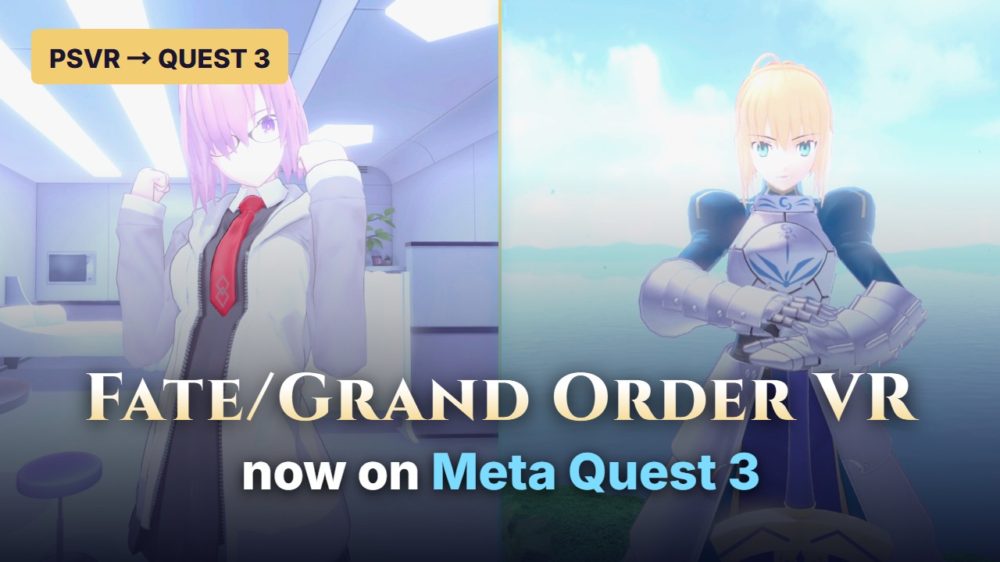

# FGO VR — PCVR 0.2.1 / Quest 3 0.2.0

[English](README.md) | [日本語](README.ja.md) | [简体中文](README.zh-CN.md) | [Français](README.fr.md) | [Deutsch](README.de.md) | [Español](README.es.md) | [Português](README.pt.md) | [Italiano](README.it.md)

Gioca a **Fate/Grand Order VR feat. Mash Kyrielight** con una build di compatibilità basata su AstroQuest/shadPS4. Il progetto supporta il titolo PS4 giapponese **CUSA09078**, nelle versioni di gioco **01.00 / 01.01**.

- **PCVR:** OpenXR tramite Virtual Desktop e VDXR.
- **Quest 3 standalone:** core ARM64 locale con FEX e Turnip; il PC non trasmette i fotogrammi del gioco.

Il progetto e i download sono pubblici. [Guarda il video dimostrativo](https://saberwatchmanga.github.io/FGO-VR/?lang=it). I pacchetti non includono dati di gioco PS4, PKG, firmware, chiavi o salvataggi. Devi fornire una tua copia del gioco estratta.

## Video dimostrativo

[](https://saberwatchmanga.github.io/FGO-VR/?lang=it)

**[▶ Guarda la dimostrazione](https://saberwatchmanga.github.io/FGO-VR/?lang=it)** · [Guarda su YouTube](https://youtu.be/zBSpUSqpUaw)

## Download

La cartella portatile completa per Windows, l’APK Quest e i sorgenti sono disponibili nella [release v0.2.1](https://github.com/saberwatchmanga/FGO-VR/releases/tag/v0.2.1):

| File | Componente |
| --- | --- |
| [FGO-VR-0.2.1-PCVR-Windows.zip](https://github.com/saberwatchmanga/FGO-VR/releases/download/v0.2.1/FGO-VR-0.2.1-PCVR-Windows.zip) | Build PCVR per Windows e impostazioni esterne della risoluzione |
| [FGO-VR-0.2.0-Quest3.apk](https://github.com/saberwatchmanga/FGO-VR/releases/download/v0.2.1/FGO-VR-0.2.0-Quest3.apk) | Build standalone per Quest 3, invariata in questo aggiornamento PC |
| [FGO-VR-0.2.1-Source.zip](https://github.com/saberwatchmanga/FGO-VR/releases/download/v0.2.1/FGO-VR-0.2.1-Source.zip) | Patch bloccate a una revisione, snapshot dei sorgenti modificati, riferimenti di build e licenze |
| `SHA256SUMS` / `artifact-manifest.json` | Verifica dei file e versioni dei componenti |

## Avvio rapido su Windows / PCVR

Requisiti: Windows a 64 bit, GPU compatibile con Vulkan e relativo driver, runtime Microsoft Visual C++, Virtual Desktop Streamer sul PC e Virtual Desktop sul visore.

1. Estrai `FGO-VR-0.2.1-PCVR-Windows.zip`.
2. Inserisci il gioco base estratto, incluso `eboot.bin`, in `FGO-PC/games/CUSA09078`. Metti l’aggiornamento facoltativo accanto, in `FGO-PC/games/CUSA09078-UPDATE`. L’aggiornamento non può essere avviato senza il gioco base.
3. Collega il visore tramite Virtual Desktop e lascia Streamer in esecuzione.
4. Fai doppio clic su **`Launch-PCVR.cmd`**. Il launcher seleziona VDXR per questo processo senza modificare l’impostazione OpenXR di sistema. Per uscire, chiudi la finestra del gioco.
5. Per cambiare risoluzione, apri **`Resolution-Settings.cmd`**. Richiede Python 3 con Tk. Salva l’impostazione e riavvia il gioco. Se non hai Python, modifica `FGO-Resolution/settings.json` oppure usa un launcher diretto in `profiles`.
6. **`Launch-PCVR-Original.cmd`** usa sempre la build alla risoluzione originale e gli stessi salvataggi.

Sono mantenuti anche i launcher originali con nomi in cinese. I font di sistema facoltativi seguono le istruzioni AstroQuest upstream; i file di sistema della console non sono inclusi.

Percorso dei salvataggi: `FGO-PC/runtime-vr/user/home/1000/savedata/CUSA09078`. Chiudi il gioco prima di copiare l’intera cartella del titolo come backup.

## Avvio rapido su Quest 3 standalone

Installa `FGO-VR-0.2.0-Quest3.apk` (pacchetto `com.fgovr.quest`, codice versione 2). Un aggiornamento con la stessa firma può mantenere i dati dell’app. Attiva il debug USB e copia le cartelle del gioco estratto in:

```text
/data/local/tmp/fgovr/games/CUSA09078
/data/local/tmp/fgovr/games/CUSA09078-UPDATE
```

Il secondo percorso serve solo per l’aggiornamento facoltativo 1.01.

Rendi i file leggibili. Per i comandi e i dettagli sull’aggiornamento, consulta [Installazione su Quest](docs/INSTALL_QUEST.md).

Con un solo Quest collegato via USB, usa lo strumento Windows delle impostazioni per inviare al Quest il valore della risoluzione, quindi chiudi e riavvia l’app. Lo strumento crea una copia di backup della configurazione esistente e modifica solo `fgo_render_scale`.

Log e impostazioni si trovano in `/sdcard/Android/data/com.fgovr.quest/files/`. `vrhost.txt` accetta `fgo_render_scale=100/110/125`. Dopo l’avvio, il gioco gira localmente sul visore.

## Profili di risoluzione

Entrambi i componenti usano per impostazione predefinita **100 / OFF**: equivale a 100% / 1.00x e mantiene la risoluzione originale. I valori più alti aumentano l’uso di GPU e memoria. Sono profili di rendering interni al gioco; la percentuale di risoluzione mostrata da VDXR è una misura separata.

| Profilo | PCVR | Quest 3 | Risultato osservato |
| --- | --- | --- | --- |
| 100 | Risoluzione originale | Risoluzione originale | Un utente Quest ha segnalato aliasing marcato |
| 110 | Disponibile | Disponibile | Un utente Quest lo ha giudicato accettabile, con aliasing visibile |
| 125 | Verificato solo all’avvio | Disponibile | Un utente Quest ha segnalato scatti evidenti |
| 150 | Disponibile | Solo PC | Un utente PCVR/VDXR ha riferito una buona qualità d’immagine e confermato il completamento dell’intero gioco |

**110** è il profilo iniziale consigliato per Quest. Le immagini Quest del video di anteprima sono state registrate in modalità standalone a 100 (1.00x); l’aliasing risulta più evidente rispetto al PC. Se hai un PC da gaming, è preferibile lo streaming PCVR tramite Virtual Desktop. Se le prestazioni sono scarse, torna a 100. Il PC di prova aveva un i5-13400F / RTX 4070 / 64 GB di RAM; non si dichiarano valori FPS quantitativi né prestazioni verificate per l’intera storia.

I target verificati per occhio sono 1408×1512 a 100, 1536×1663 a 110, 1792×1890 a 125 e 2048×2268 a PC150. La patch sostituisce la richiesta canonica verificata del gioco pari a 1.4f, preserva le altre richieste e i controlli di allocazione ed evita moltiplicazioni ripetute della scala.

### Correzione delle transizioni in PCVR 0.2.1

Con una risoluzione più alta, una transizione della storia esauriva in precedenza il pool fisso di memoria grafica del gioco. Un messaggio di memoria esaurita malformato causava poi un secondo arresto anomalo. PCVR 0.2.1 aumenta insieme il pool grafico e il corrispondente budget locale al processo di memoria Backing/Direct, e corregge il formato del messaggio. Il budget aggiuntivo non viene salvato nelle impostazioni.

Il **7 ottobre 2026**, l’utente ha confermato **di aver completato l’intero gioco su PCVR / VDXR a 1.50x**. Anche la transizione che causava l’arresto anomalo ha superato il nuovo test e la sessione registrata si è chiusa normalmente. Sono state superate anche le verifiche di avvio PC125/150 e il ripristino a 100. APK e sorgenti Quest restano alla versione 0.2.0; questa correzione PC non è stata applicata a Quest.

Lo SHA-256 del core accettato è `563be6008f73855c3b4425c93bca104692999e97f0fb16cf956c5d3aa40123c1`.

Consulta i [dettagli dei test](TESTING.md) e il [record di accettazione dell’utente](docs/USER_ACCEPTANCE_20261007.md).

- Una successiva sessione PC150 si è chiusa per una violazione di accesso durante il precaricamento Unity. La causa non è stata individuata; vedi i [dettagli dei test](TESTING.md).

## Comandi

| Input | Mappatura |
| --- | --- |
| Left Touch stick | Direzioni del menu |
| Left / right grip | L1 / R1 |
| Left / right trigger | L2 / R2 |
| Right A | Cross / conferma |
| Pressione simultanea di entrambi gli stick | Ricentra |
| Keyboard Q / E | Conferma |
| Keyboard arrows | Selezione nel menu |

La posa di mira della mano destra viene collegata al normale tracciamento DualShock del gioco. I comandi di base funzionano. Il supporto completo a Move, la mira precisa e tutte le interazioni di addestramento non sono stati convalidati.

## Limiti attuali

- Quest125 presenta scatti sul visore dell’utente; Quest110 mostra ancora aliasing.
- **PCVR / VDXR 1.50x: l’utente ha confermato il completamento dell’intero gioco.** In questa tornata di correzioni PC125 è stato verificato solo all’avvio.
- Non sono state valutate separatamente la stabilità dopo esecuzioni ripetute, gli FPS misurati sul visore o il comfort su altro hardware.
- Mancano ancora alcuni layer di reproiezione aggiuntivi, il supporto completo a Move e alcune interfacce di tracking.
- Questa build è destinata a FGO VR. Gli altri giochi PSVR richiedono verifiche di compatibilità specifiche.

## Sorgenti, build e crediti

Basato su [AstroQuest](https://github.com/bigmak94/AstroQuest), fissato al commit `9f42c44d4e838e3a0df67913e350c4f098110862`, e su [shadPS4](https://github.com/shadps4-emu/shadPS4).

Le patch complete per piattaforma sono in `patches`; i file modificati sono in `source_snapshot`. **Applica una sola patch completa per la piattaforma scelta. Non sovrapporre patch di fasi precedenti.**

`tools/prepare_source.py` recupera i sorgenti upstream fissati e applica la patch della piattaforma selezionata. Per gli input fissati e gli script di riferimento, consulta le [istruzioni di build](docs/BUILD.md). Alcuni percorsi degli sviluppatori vanno adattati; non è dichiarata una build con un solo clic su una macchina pulita. Le chiavi di firma della release non sono incluse.

Le note sui sorgenti restano sotto GPL-2.0-or-later e le licenze di terze parti applicabili. Consulta [LICENSE](LICENSE), [THIRD-PARTY-NOTICES.md](THIRD-PARTY-NOTICES.md) e gli avvisi upstream. Questo è un progetto di compatibilità non ufficiale; il gioco originale e i personaggi appartengono ai rispettivi titolari dei diritti.

## Supporto

Se questo progetto ti è utile, puoi sostenere il suo sviluppo continuativo su [Ko-fi / terry2418](https://ko-fi.com/terry2418). Grazie per il tuo supporto.
